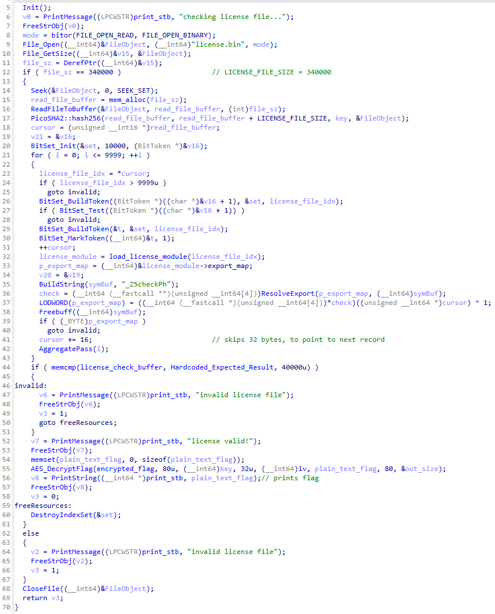
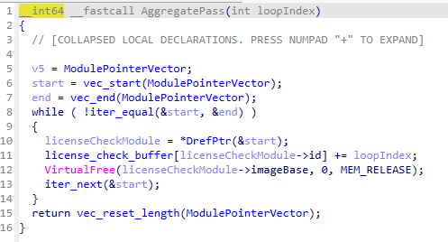
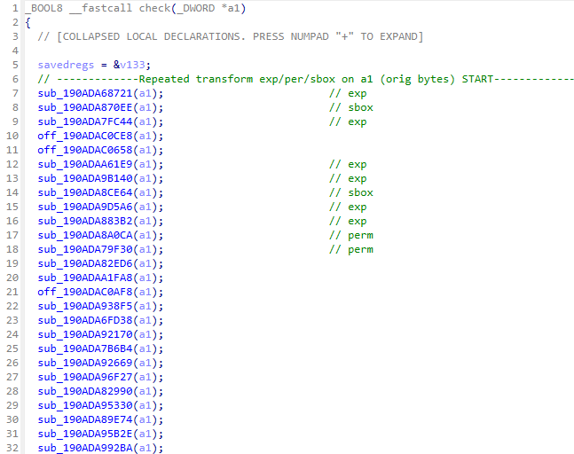
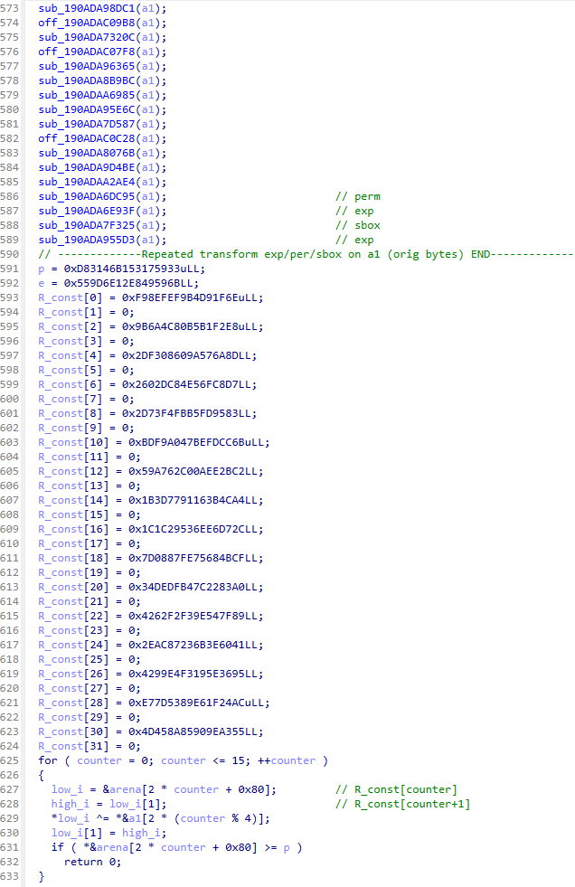
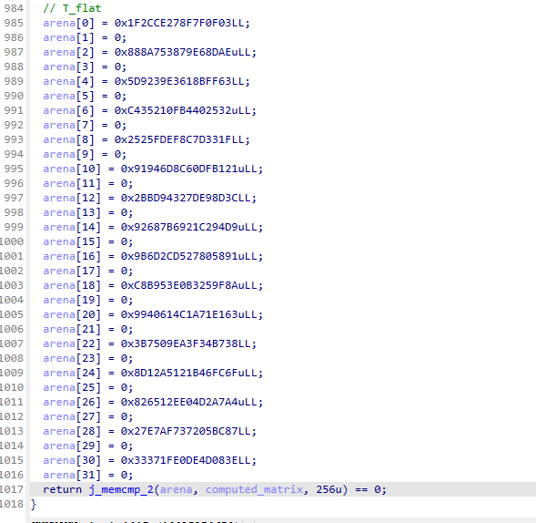

# Ch9

## Summary

Challenge 9 of Flare-On 12 presents a complex reverse engineering challenge involving 10,000 interconnected DLL modules that collectively form a licensing system. The solution requires:

1. **Dependency Analysis**: Solving a large system of equations to determine the correct loading order of 10,000 modules
2. **Cryptographic Analysis**: Extracting and inverting multiple layers of transforms including matrix operations, S-box substitutions, and modular exponentiation

The challenge demonstrates advanced concepts in:

- Large-scale linear system solving using peeling algorithms
- Matrix group theory and characteristic polynomial factorization
- Modular arithmetic and cryptographic primitive inversion
- Parallel orchestration with deterministic output ordering

**Final Result**: Successfully recovered flag `Its_l1ke_10000_spooO0o0O0oOo0o0O0O0OoOoOOO00o0o0Ooons@flare-on.com`

Total script execution time around **35 minutes**.

1. Extract H - 169 s
2. Build closure - 409 s
3. Solve position - 30 s
4. Extract crypto constants - 526 s
5. XOR snapshot and bin file  - 42 s
6. Invert matrix - 170 s
7. Recover original bytes - 1250 s
8. calc Sha - 0.1 s
9. Flag - 0.1 s

Serial execution 1 + 2 + 3 = 590 s  
parallel execution 4 = 526 s

Total time until 4 = 590 s

Serial execution 5 + 6 + 7 + 8 + 9 = 1462 s

$\text{Final total time } \Rightarrow 1462 + 590 = 34.2\text{ Minutes}.$

---

## Challenge Architecture Overview

### Code



The challenge consists of a main executable (`10000.exe`) which contains $10000$ dlls compressed in it's resource (numbered 0-9999). Each DLL contributes a 32-byte payload that must be recovered in the correct order to build a valid license file (`license.bin`). The license's SHA256 hash serves as the AES key to decrypt the embedded flag.

```log
┌────────────────────────────────────────────────────────────────┐
│                    Challenge Flow                              │
├────────────────────────────────────────────────────────────────┤
│ 10000.exe →  extract and decompress 0.dll...9999.dll from rsrc │
│           ↓                                                    │
│ Stage 1: Extract H array + Build closures                      │
│           ↓                                                    │
│ Stage 2: Extract transforms + Generate XOR snapshots           │
│           ↓                                                    │
│ Stage 3: Invert transforms + Recover payloads                  │
│           ↓                                                    │
│ license.bin → SHA256 → AES key → Flag                          │
└────────────────────────────────────────────────────────────────┘
```

`license.bin` file is structured as:

- First $2\text{ bytes (see code line:18)}$ for module numebr or id (0...9999)
- Then following $32\text{ bytes}$ is the input that will be passed to exported function name `check` of currently loaded DLL for verification.

So, the size of the license file should be exactly: $32 + 2 = 34\text{ bytes} \Rightarrow 34 \times 10000\text{ (1 record per dll)} = 340000\text{ bytes}$  
This strict file size check is encforced at `line:12` in the code.

---

## Stage 1: Dependency Resolution & Module Ordering

### Objective

Establish the correct load sequence for all 10,000 modules by reconstructing the dependency graph and solving the resulting system of linear constraints.  

This requires reversing the logic implemented in the `AggregatePass` function (`line:42`), which updates the global `license_check_buffer` after each module successfully validates its 32‑byte input slice (`cursor`). The buffer’s final state determines whether the license passes integrity checks, so understanding this transformation is essential for deriving the true dependency order.



### Core Scripts

#### [extract_h.py](./stage1/extract_h.py)

**Purpose**: Extract a hardcoded array $H$ (`Hardcoded_Expected_Result` used in `memcmp` as can be seen at `line:44` of the main code snippet) of 10,000 uint32 values from the main executable.
The script reads from RVA 0xCC000 in the executable to extract array H where:

```C
H = [h₀, h₁, h₂, ..., h₉₉₉₉]
```

This array represents the "expected result" values used in the final validation.

#### [build_closures.py](./stage1/build_closures.py)

**Purpose**: Construct transitive dependency closures for all modules.
**Mathematical Foundation**:
For each module m, compute its closure C_m:

```C
C_m = {m} ∪ ⋃ (dependencies of m, recursively)
```

**Closure Construction**:

- **Direct dependencies:**  
  $$D(m) = \text{set of numeric imports of module } m$$
- **Closure:**  
  $$C(m) = \{ m \} \cup \bigcup_{u \in D(m)} C(u)$$
- **Contributors matrix:**  
  $$
  A_{d,m} =
    \begin{cases}
      1, & d \in C(m) \\
      0, & \text{otherwise}
    \end{cases}
  $$

_*Explanation*_: The closure of module m includes itself plus all modules that any of its direct dependencies depend on, computed recursively. Think of it like "everything m needs to function, directly or indirectly."

**Results from script logs**:

```bash
PS 10/21/2025 23:51:23 Stage1> # 1. Extract H (hardcoded constants that are used in final memcmp)
PS 10/21/2025 23:52:33 Stage1> py .\run.py .\extract_h.py ..\10000.exe --rva 0xCC000 # The hardcoded buffer is at RVA 0xCC000 in the executable 10000.exe
► Harness extract_h.py  (runs: 1)
  args: ..\10000.exe --rva 0xCC000
[+] Extracted 10000 uint32 entries to hardcoded_expected.json
[+] Distinct values: 9998  Range: [498, 49752356]
[*] H is NOT a simple permutation; dependencies overlap (needs system solve).
[ 1/1] OK       wall=   0.169 s cpu=   0.109 s

Summary
┌────────────────────────────────────────────────┐
│ Metric │ Values                                │
├────────────────────────────────────────────────┤
│ Wall   │ min 0.169 s  avg 0.169 s  max 0.169 s │
│ CPU    │ min 0.109 s  avg 0.109 s  max 0.109 s │
└────────────────────────────────────────────────┘
PS 10/21/2025 23:54:58 Stage1> lsnames -FilesOnly # we should see new file hardcoded_expected.json created

Name                                  Size Modified
----                                  ---- --------
🐍 build_closures.py                  4838 2025-10-12 01:10:11
🐍 derive_order_and_build_license.py  5985 2025-10-12 01:15:22
🐍 extract_h.py                       1885 2025-10-12 00:41:40
🧾 hardcoded_expected.json           97479 2025-10-21 23:54:58
🐍 run.py                            14188 2025-10-21 23:40:43
🐍 solve_positions_peeling.py         3294 2025-10-12 01:37:04
🐍 validate_closures_vs_H.py          2173 2025-10-12 01:01:30

PS 10/21/2025 23:55:55 Stage1> (Get-Content .\hardcoded_expected.json -Raw).Substring(0,80)
[34950827, 1111565, 23824527, 35564631, 6957343, 2500832, 45269251, 33506221, ..]

PS 10/21/2025 23:58:54 Stage1> # 2. Now let's build the closure i.e. dependencies graph of module loads
PS 10/22/2025 00:01:03 Stage1> py .\run.py .\build_closures.py ..\..\resources\rcdatas\ # Here we pass the path containing 0...9999.dll files
► Harness build_closures.py  (runs: 1)
  args: ..\..\resources\rcdatas\
[*] Parsing direct numeric dependencies...
Loading module dependencies: 100%|█████████████████████████████████████████████████████████████████████████████████████| 10000/10000 [02:44<00:00, 60.85module/s]
[*] Building transitive closures...
Building closures: 100%|███████████████████████████████████████████████████████████████████████████████████████████████| 10000/10000 [03:24<00:00, 48.91module/s]
[+] Closure size stats: min=1 max=9955 avg=4931.070
[+] Most common sizes: [(1, 22), (2, 10), (3, 8), (5, 7), (8, 7)]
[+] Wrote closures to closures.json
[*] Non-trivial: 9978 modules have dependencies >1.
[ 1/1] OK       wall=  409.14 s cpu=  404.50 s

Summary
┌───────────────────────────────────────────────────┐
│ Metric │ Values                                   │
├───────────────────────────────────────────────────┤
│ Wall   │ min 409.14 s  avg 409.14 s  max 409.14 s │
│ CPU    │ min 404.50 s  avg 404.50 s  max 404.50 s │
└───────────────────────────────────────────────────┘
```

- Closure sizes: min=1, max=9,955, average≈4,931
- 9,978 modules have non-trivial dependencies (size > 1)
- Total processing time: 578 seconds

#### Now using [solve_positions_peeling.py](./stage1/solve_positions_peeling.py) we will derive the DLL load order

**Peeling Algorithm - singleton row elimination**:

```c
If |{m : d ∈ C_m}| = 1, then P_m = H[d]
```

### Core Equations

1. **System of equations (given data vs positions):**  
   $$
   H[d] = \sum_{m \in \text{contributors}[d]} p[m]
   $$
   Where:  
   - $H[d]$: provided sum for row $d$  
   - $p[m]$: position (index) of module $m$

2. **Peeling rule (single contributor row):**  
   If the list `contributors[d]` has size 1 and its sole module is $m$:  
   $$
   p[m] = H[d]
   $$  
   Propagate to every other row $d'$ containing $m$:  
   $$
   H[d'] \leftarrow H[d'] - p[m], \quad \text{remove } m \text{ from } \text{contributors}[d']
   $$

3. **Final order array:**  
   $$
   \text{order}[\,p[m]\,] = m
   $$

_*Explanation*_: If position d appears in exactly one module's closure, then that module's position is simply H[d]. After solving, subtract this contribution from all other equations.

Tiny illustrative example

Suppose `N=4` and closures are:

- `C(0) = {0}`
- `C(1) = {1,0} (1 depends on 0)`
- `C(2) = {2}`
- `C(3) = {3,2} (3 depends on 2)`

Then contributors by row (who includes the row in their closure):

- `Row 0: contributors = {0, 1}`
- `Row 1: contributors = {1}`
- `Row 2: contributors = {2, 3}`
- `Row 3: contributors = {3}`

Let the unknown positions be `p[0], p[1], p[2], p[3]` and suppose:

- `H[1] = p[1]` (Row 1 has only contributor 1 → singleton)
- `H[3] = p[3]` (Row 3 has only contributor 3 → singleton) Peeling:

1. From Row 1: `p[1] = H[1]`
    - Subtract `p[1]` from rows where 1 contributes: rows 0 and 1 (since `C(1) = {1,0}`).
2. From Row 3: `p[3] = H[3]`
    - Subtract `p[3]` from rows where 3 contributes: rows 3 and 2 (since `C(3) = {3,2}`).
3. Now Row 0 becomes singleton with contributor `{0} → p[0] = updated H[0]`.
4. Row 2 becomes singleton with contributor     `{2} → p[2] = updated H[2]`.

**Results from logs**:

```bash
PS 10/22/2025 00:10:33 Stage1> lsnames -FilesOnly # we have now build the closure.json which will be used to derive the order of DLL load

Name                                      Size Modified
----                                      ---- --------
🐍 build_closures.py                      4838 2025-10-12 01:10:11
🧾 closures.json                     290457204 2025-10-22 00:10:29
🐍 derive_order_and_build_license.py      5985 2025-10-12 01:15:22
🐍 extract_h.py                           1885 2025-10-12 00:41:40
🧾 hardcoded_expected.json               97479 2025-10-21 23:54:58
🐍 run.py                                14188 2025-10-21 23:40:43
🐍 solve_positions_peeling.py             3294 2025-10-12 01:37:04
🐍 validate_closures_vs_H.py              2173 2025-10-12 01:01:30

PS 10/22/2025 00:11:38 Stage1> py .\run.py .\solve_positions_peeling.py --H .\hardcoded_expected.json --closures .\closures.json
► Harness solve_positions_peeling.py  (runs: 1)
  args: --H .\hardcoded_expected.json --closures .\closures.json
[+] Solved 10000 module positions by peeling.
[+] Full solution found.
[+] Wrote ordering.json (license module id sequence).
[ 1/1] OK       wall=   30.53 s cpu=   30.23 s

Summary
┌────────────────────────────────────────────────┐
│ Metric │ Values                                │
├────────────────────────────────────────────────┤
│ Wall   │ min 30.53 s  avg 30.53 s  max 30.53 s │
│ CPU    │ min 30.23 s  avg 30.23 s  max 30.23 s │
└────────────────────────────────────────────────┘
PS 10/22/2025 00:17:37 Stage1> lsnames -FilesOnly # we now have the DLL load order

Name                                      Size Modified
----                                      ---- --------
🐍 build_closures.py                      4838 2025-10-12 01:10:11
🧾 closures.json                     290457204 2025-10-22 00:10:29
🐍 derive_order_and_build_license.py      5985 2025-10-12 01:15:22
🐍 extract_h.py                           1885 2025-10-12 00:41:40
🧾 hardcoded_expected.json               97479 2025-10-21 23:54:58
🧾 ordering.json                         58890 2025-10-22 00:17:36
🐍 run.py                                14188 2025-10-21 23:40:43
🐍 solve_positions_peeling.py             3294 2025-10-12 01:37:04
🐍 validate_closures_vs_H.py              2173 2025-10-12 01:01:30

PS 10/22/2025 00:18:09 Stage1> (Get-Content .\ordering.json -Raw).Substring(0,100) # Let's peek into the ordering.json
[7476, 5402, 4885, 5176, 6815, 7764, 9981, 655, 6606, 7019, 4404, 5582, 964, 5253, 5359, 6854, 4978, ...]
PS 10/22/2025 00:19:13 Stage1> # This ends our stage 1
```

- Successfully solved all 10,000 positions in 30.53 seconds
- Output: `ordering.json` containing the module loading sequence

---

## Stage 2: Transform Constant Extraction & XOR Snapshot Generation

### Objective

Extract cryptographic transformation parameters from each DLL and simulate the dynamic execution environment.

### Core Scripts

#### [extract_mat_and_transform_consts.py](./Stage2/extract_mat_and_transform_consts.py)

**Purpose**: Analyze each DLL's exports to extract transformation constants and classify operations.
The script identifies four types of transforms:

1. **Matrix operations** (34 constants for: $p\text{ (prime field) }, e\text{ (exponent) }, T\_flat[16]\text{ (target matrix) }, R\_const[16]\text{ (matrix init const) }$)
2. **Permutation** (4 constants defining index mapping)
3. **S-box/Confusion** (32 constants for substitution tables)
4. **Diffusion/Exponentiation** (4 constants for modular exponentiation)

**Transform Classification**:

```C
classify(export) → {confusion, diffusion, permutation}
```

**Results from logs**:

```bash
PS 10/22/2025 00:54:31 Stage2> ## In stage 2 we will extract the constants used in DLL for matrices and input transformation.
PS 10/22/2025 00:59:15 Stage2> ## We will also compute the snapshot of XOR values used for all the loaded modules by the current DLL and used during tranform
PS 10/22/2025 01:02:39 Stage2> ## in the "check" function of the current DLL
PS 10/22/2025 01:03:24 Stage2>
PS 10/22/2025 01:03:26 Stage2> lsnames -FilesOnly # We'll start with following scripts, extract_mat...py for constant extraction and *_xor..py for XOR snap

Name                                    Size Modified
----                                    ---- --------
🐍 compute_xor_snapshots.py             7597 2025-10-22 00:32:32
🐍 extract_mat_and_transform_consts.py 18224 2025-10-22 01:15:35
🐍 make_xor_offset_bin.py                603 2025-10-20 01:42:17

PS 10/22/2025 01:21:42 Stage2> # To the first script extract_mat_and_transform....py we pass path to dll files, output path to write const and DLL order json
PS 10/22/2025 01:24:16 Stage2> py .\..\run.py .\extract_mat_and_transform_consts.py ..\..\resources\rcdatas\ . ..\Stage1\ordering.json
► Harness extract_mat_and_transform_consts.py  (runs: 1)
  args: ..\..\resources\rcdatas\ . ..\Stage1\ordering.json
DLLs: 100%|███████████████████████████████████████████████████████████████████████████████| 10000/10000 [08:45<00:00, 19.02dll/s, fail=0, missing=0, ok=1e+4\]
Processed 10000 DLLs (ok=10000, missing=0, fail=0)
[ 1/1] OK       wall=  526.01 s cpu=   10.77 s

Summary
┌───────────────────────────────────────────────────┐
│ Metric │ Values                                   │
├───────────────────────────────────────────────────┤
│ Wall   │ min 526.01 s  avg 526.01 s  max 526.01 s │
│ CPU    │ min 10.77 s  avg 10.77 s  max 10.77 s    │
└───────────────────────────────────────────────────┘
PS 10/22/2025 01:33:22 Stage2> lsnames -FilesOnly # we now have the constants extracted and transformation analyzed and stored in following dirs

Name                                    Size Modified
----                                    ---- --------
🐍 compute_xor_snapshots.py             7597 2025-10-22 00:32:32
🐍 extract_mat_and_transform_consts.py 18224 2025-10-22 01:15:35
🐍 make_xor_offset_bin.py                603 2025-10-20 01:42:17

PS 10/22/2025 01:34:40 Stage2> lsnames # we now have the constants extracted and transformation analyzed and stored in following dirs

Name                                   Size  Modified
----                                   ----  --------
📁 call_chain                                2025-10-22 01:33:22
🐍 compute_xor_snapshots.py            7597  2025-10-22 00:32:32
📁 confusions                                2025-10-22 01:33:22
📁 diffusions                                2025-10-22 01:33:22
🐍 extract_mat_and_transform_consts.py 18224 2025-10-22 01:15:35
🐍 make_xor_offset_bin.py              603   2025-10-20 01:42:17
📁 mat_transforms                            2025-10-22 01:33:21
📁 permutations                              2025-10-22 01:33:22
📁 transform_order                           2025-10-22 01:33:22
```

- Processed 10,000 DLLs in 526.01 seconds at ~19 DLL/s
- Generated structured metadata in directories: `confusions/`, `diffusions/`, `permutations/`, `mat_transforms/`, `transform_order/`, `call_chain/`

#### [compute_xor_snapshots.py](./Stage2/compute_xor_snapshots.py)

##### Purpose: Generate per-iteration XOR state snapshots that track dynamic execution context

**Goal:**

- For each iteration $i$, produce snapshot XOR key values for all modules in the active closure set.
- Maintain evolving module buffers.

##### Key Concepts

- **Buffer:** $B[m]$ = 32‑bit unsigned integer state for module $m$.
- **Active set at iteration $i$:**  
  $$
  S_i = C(\text{order}[i]) \cup \{ \text{order}[i] \}
  $$

##### Core Equations

1. **Buffer value before applying iteration $i$ update:**  
   $$
   B[m]^{(i)} = \sum_{j=0}^{i-1} \mathbf{1}[\, m \in S_j \,]\cdot j \pmod{2^{32}}
   $$

2. **Update rule (transition $i \to i+1$):**  
   $$
   B[m]^{(i+1)} =
   \begin{cases}
     (B[m]^{(i)} + i) \bmod 2^{32}, & m \in S_i \\
     B[m]^{(i)}, & m \notin S_i
   \end{cases}
   $$

3. **Final buffer value (after $N$ iterations):**  
   $$
   B[m]^{(\text{final})} =
   \sum_{j=0}^{N-1} \mathbf{1}[\, m \in S_j \,]\cdot j \pmod{2^{32}}
   $$

_*Explanation*_: At iteration i, for every position k in the closure of module M_i being processed, add the iteration number $i$ to counter $B(m)$. This creates time-dependent "XOR keys" used in cryptographic transforms.

**Results from logs**:

```bash
PS 10/22/2025 01:34:54 Stage2> # The next step we build XOR snapshot
PS 10/22/2025 01:36:38 Stage2> py .\..\run.py .\compute_xor_snapshots.py --module-order ..\Stage1\ordering.json --closure ..\Stage1\closures.json --out-dir .
► Harness compute_xor_snapshots.py  (runs: 1)
  args: --module-order ..\Stage1\ordering.json --closure ..\Stage1\closures.json --out-dir .
[OK] Wrote NDJSON snapshots to: .\snapshots.ndjson
[ 1/1] OK       wall=   41.63 s cpu=   40.12 s

Summary
┌────────────────────────────────────────────────┐
│ Metric │ Values                                │
├────────────────────────────────────────────────┤
│ Wall   │ min 41.63 s  avg 41.63 s  max 41.63 s │
│ CPU    │ min 40.12 s  avg 40.12 s  max 40.12 s │
└────────────────────────────────────────────────┘
PS 10/22/2025 01:38:43 Stage2> lsnames -FilesOnly # we will see a new .ndjson file being written

Name                                        Size Modified
----                                        ---- --------
🐍 compute_xor_snapshots.py                 7597 2025-10-22 00:32:32
🐍 extract_mat_and_transform_consts.py     18224 2025-10-22 01:15:35
🐍 make_xor_offset_bin.py                    603 2025-10-20 01:42:17
📦 snapshots.ndjson                    740870758 2025-10-22 01:38:41

PS 10/22/2025 01:40:25 Stage2> # This is an optional step where we just build indexes for snapshots.ndjson for faster processing it plays no role in soln.
PS 10/22/2025 01:42:11 Stage2> py .\..\run.py .\make_xor_offset_bin.py
► Harness make_xor_offset_bin.py  (runs: 1)
Index built: offsets.bin
[ 1/1] OK       wall=   1.159 s cpu=   1.141 s

Summary
┌────────────────────────────────────────────────┐
│ Metric │ Values                                │
├────────────────────────────────────────────────┤
│ Wall   │ min 1.159 s  avg 1.159 s  max 1.159 s │
│ CPU    │ min 1.141 s  avg 1.141 s  max 1.141 s │
└────────────────────────────────────────────────┘
PS 10/22/2025 01:42:31 Stage2> lsnames -FilesOnly

Name                                        Size Modified
----                                        ---- --------
🐍 compute_xor_snapshots.py                 7597 2025-10-22 00:32:32
🐍 extract_mat_and_transform_consts.py     18224 2025-10-22 01:15:35
🐍 make_xor_offset_bin.py                    603 2025-10-20 01:42:17
📦 offsets.bin                             80000 2025-10-22 01:42:31
📦 snapshots.ndjson                    740870758 2025-10-22 01:38:41

PS 10/22/2025 01:42:56 Stage2> # Now stage 2 is complete - here we extracted constants and computed XOR snapshot
```

- Generated `snapshots.ndjson` (741MB) in 41.63 seconds
- Created optional index file `offsets.bin` for fast access

---

## Stage 3: Cryptographic Inversion & Payload Recovery

### Code

#### Long chain of transformation function that modifies 32 bytes input



#### This tranformed bytes are XORed with R_const and checked if it's still withing prime field (p)



_Note: The value of R_const is not modied during this operaion_

#### Lastly it's compare to be equal to 256 bytes of store T_flat



### Objective

Invert all cryptographic transforms to recover original 32-byte payloads from each module.

### Core Script [invert.py](./stage3/invert.py)

#### Overview

The script implements three byte-level reversible transforms (Exponentiation, S-box, Permutation) over 32-byte blocks and a separate algebraic routine to recover a 32‑byte secret from a 4×4 matrix over a prime field by “extracting an e-th root” with characteristic polynomial factor reasoning.

### Notation

- A 32‑byte block is treated as a 256‑bit little-endian integer:  
  $$\text{bytes} \;\; b[0..31] \quad\longleftrightarrow\quad X = \sum_{i=0}^{31} b_i \, 256^i.$$
- Let $c$ be the 8-bit check byte (named `check_byte`).
- Let $\operatorname{LSB}(x) = x \bmod 2$.
- All modular powers use Python’s built-in fast exponentiation: $\text{pow}(a, e, M) = a^e \bmod M$.

**Key Mathematical Operations**:

### 1. Matrix Root Inversion

We are given:

- Prime $p$.
- Exponent $e$.
- Flattened matrix entries $T_{\text{flat}}$ (16 integers).
- Constants $R_{\text{const}}$ (16 integers).

Build:
$$T \in M_{4}(\mathbb{F}_p), \quad T_{i,j} = T_{\text{flat}}[4i + j] \bmod p.$$

**Characteristic Polynomial Factorization**:

```C
charpoly(T) = ∏ᵢ fᵢ(x)^mᵢ over GF(p)
```

Compute
$$\chi_T(x) = \det(xI - T) \in \mathbb{F}_p[x].$$
Factor over $\mathbb{F}_p$:
$$\chi_T(x) = \prod_{i} f_i(x)^{m_i}, \quad \deg f_i = d_i.$$

Each irreducible factor $f_i$ of degree $d_i$ corresponds to eigenvalues in the extension field $\mathbb{F}_{p^{d_i}}$, whose multiplicative group has order $p^{d_i} - 1$. If $T$ is diagonalizable in a product of these extensions (or at least its semisimple part has this behavior), its order divides:
$$L = \operatorname{lcm}_{i} (p^{d_i} - 1).$$

**Matrix Root Recovery**:

```C
d = E⁻¹ mod L
A = T^d mod p
```

To find matrix A such that A^E = T, we compute d (the modular inverse of E) and raise T to the power d.

Details:  
We assume $T = A^{e}$ for some unknown $A$ and $\gcd(e, L) = 1$. Then there exists $d$ such that:
$$d \equiv e^{-1} \pmod{L}.$$
Choose:
$$A = T^{d} \quad (\text{matrix exponentiation mod } p).$$
Verification:
$$A^{e} = T^{de} = T^{1 \bmod L} = T.$$

Matrix powering:
$$T^{d} = \underbrace{T \cdot T \cdot \dots \cdot T}_{d\text{ times}} \pmod p,$$
implemented via binary exponentiation on 4×4 matrices.

**Recovering W Words**:

Flatten $A$ (row-major):
$$A_{\text{flat}}[k] = A_{\lfloor k/4 \rfloor,\; k \bmod 4}, \quad 0 \le k < 1$$

For each column index $c \in \{0,1,2,3\}$ define index set:
$$I_c = \{ k \mid k \bmod 4 = c,\ 0 \le k < 16 \}.$$

Given constants $R_{\text{const}}[k]$, define per-position candidates:
$$\mathcal{C}_{k} = \{ A_{\text{flat}}[k] \oplus R_{\text{const}}[k],\ (A_{\text{flat}}[k] + p) \oplus R_{\text{const}}[k] \}.$$

(Lifting by $+p$ accounts for ambiguity between representatives modulo $p$ versus integers before XOR.)

Intersect within the column:
$$W_c = \bigcap_{k \in I_c} \mathcal{C}_{k}.$$

The code expects $|W_c| = 1$ (unique recovery). Then:
$$W = (W_0, W_1, W_2, W_3) \quad \text{(each a 64-bit word)}.$$

**Final Byte Reconstruction**:

Each $W_i$ is split into two little-endian 32-bit halves:
$$W_i = \text{lo}_i + 2^{32} \cdot \text{hi}_i.$$

Collect eight dwords:
$$(\text{lo}_0, \text{hi}_0, \text{lo}_1, \text{hi}_1, \text{lo}_2, \text{hi}_2, \text{lo}_3, \text{hi}_3),$$
serialize to 32 bytes little-endian:
$$\text{bytes} = \text{LE}_{4}(\text{lo}_0) \| \text{LE}_{4}(\text{hi}_0) \| \dots \| \text{LE}_{4}(\text{hi}_3).$$

This reconstructs the target original 32-byte secret.

### 2. Exponentiation Transform Inversion

**Modular Exponentiation Inverse**:

```C
Forward:  Y = (X | 1)^E mod 2²⁵⁶  (with bit manipulations)
Inverse:  X = Y^(E⁻¹ mod 2²⁵⁴) mod 2²⁵⁶  (with bit restoration)
```

#### Forward

Given input bytes $x$, parse constants into a 248-bit exponent fragment (31 bytes) extended as little-endian to an integer $E$:
$$E = \text{LE}_{31}(\text{exp\_bytes}).$$
(Internally stored in 31 bytes; treated as integer modulo $2^{248}$ but used directly.)

Convert the 32-byte block to integer:
$$X = \text{LE}_{32}(x).$$

Apply pre-XOR with the check byte:
$$X_0 = X \oplus c.$$

Force oddness (inject into group of odd residues mod $2^{256}$):
$$b = \operatorname{LSB}(X_0), \qquad X_1 = X_0 \lor 1.$$

Exponentiate modulo $2^{256}$:
$$Y_0 = X_1^{E} \bmod 2^{256}.$$

Inject an LSB “bit whitening” using the original parity:
$$Y = Y_0 \oplus (b \oplus 1).$$

Encode back to 32 bytes (little-endian):
$$\text{forward\_exponent}(x) = \text{LE}_{32}^{-1}(Y).$$

So overall:
$$\boxed{Y = ( ( (X \oplus c) \lor 1 )^{E} \bmod 2^{256} ) \oplus ( \operatorname{LSB}(X \oplus c) \oplus 1 )}.$$

#### Inverse

Given $y$:
$$Y = \text{LE}_{32}(y).$$

Force oddness again:
$$Z = Y \lor 1.$$

Compute an “inverse exponent”:
$$D \equiv E^{-1} \pmod{2^{254}}.$$
(Implementation note: The multiplicative group of odd residues modulo $2^{256}$ has order $2^{255}$; using $2^{254}$ here effectively restricts to a subgroup or compensates for the LSB toggling. The script assumes $E$ invertible modulo $2^{254}$.)

Root extraction:
$$S_0 = Z^{D} \bmod 2^{256}.$$

Restore original parity bit:
$$b = \operatorname{LSB}(Y), \qquad S_1 = (S_0 \land \sim 1) \lor b.$$

Undo initial XOR:
$$X = S_1 \oplus c.$$

Return $\text{LE}_{32}^{-1}(X)$.

So inverse equation:
$$\boxed{X = \big( ( (Y \lor 1)^{D} \bmod 2^{256} \land \sim 1 ) \lor \operatorname{LSB}(Y) \big) \oplus c }.$$

### 3. S-box Inversion

**Equation 9 (Substitution Inversion)**:

```C
Forward:  Y[i] = S[X'[i]]  where X' = X ⊕ check_key
Inverse:  X'[i] = S⁻¹[Y[i]]  then X = X' ⊕ check_key
```

A 256-byte substitution table $T$ is built by concatenating 32 provided 64-bit constants in little-endian form:
$$T[i] = \text{byte at position } i \text{ in constructed 256-byte array}, \quad 0 \le i < 256.$$

Forward:

1. Pre-XOR first 4 bytes (little-endian dword) with $c$:
   $$x'[0..3] = (x[0..3] \oplus c_{\text{u32}}).$$
2. Apply byte-wise substitution:
   $$y[i] = T[x'[i]], \quad 0 \le i < 32.$$

Inverse rebuilds an inverse map $T^{-1}$:
$$x'[i] = T^{-1}[y[i]], \quad 0 \le i < 32,$$
then XORs first dword with $c$ again.

The XOR-before-substitution and XOR-after-inverse structure keeps diffusion localized in the first 4 bytes while the S-box provides non-linearity over all 32 positions.

### 4. Permutation Inversion

**Equation 10 (Index Permutation Inverse)**:

```C
Forward:  Y[i] = X'[π[i]]  where π is permutation mapping
Inverse:  X'[i] = Y[π⁻¹[i]]  where π⁻¹ is inverse permutation
```

Permutation reorders bytes according to mapping π. Inversion uses the inverse permutation π⁻¹.

From four 64-bit constants (total 32 bytes) create an index array:
$$\pi[i] = \text{byte } i \text{ of idx\_bytes}, \quad 0 \le i < 32.$$

Forward:

1. XOR first dword with $c$:
   $$x'[0..3] = x[0..3] \oplus c_{\text{u32}}.$$
2. Permute:
   $$y[i] = x'[\pi[i]], \quad 0 \le i < 32.$$

Inverse builds inverse permutation $\pi^{-1}$:
$$x'[j] = y[\pi^{-1}(j)],$$
then XORs first dword with $c$ to recover original.

### [recover_bytes_multi.py](./stage3/recover_bytes_multi.py) - Orchestrator

**Purpose**: Coordinate parallel recovery of all 10,000 modules with deterministic output ordering.

**Orchestration Strategy**:

1. Precompute matrix inversions (expensive operations)
2. Spawn worker processes for parallel transform application
3. Maintain ordered output despite parallel completion
4. Cache intermediate results for performance

_Explanation_: Even though modules finish processing in parallel out of order, we only write results when it's the next expected module in the global ordering O, ensuring reproducible output.

**Results from logs**:

```bash
PS 10/22/2025 14:57:53 Stage2> cd ..\Stage3 # Switching to stage 3
PS 10/22/2025 14:58:01 Stage3> # We will start the recovery now this will take the most amount of time in this challenge.
PS 10/22/2025 14:58:35 Stage3> $env:CHARPOLY_CACHE_DIR = "$env:LOCALAPPDATA\\charpoly_cache" # cache used for matrix charpoly
PS 10/22/2025 14:58:53 Stage3> $env:USE_GMP_MUL = "1" # to use GMP library for mat multiply
PS 10/22/2025 14:59:00 Stage3> $env:FLINT_CHARPOLY = "1" # use FLINT for charpoly
PS 10/22/2025 14:59:08 Stage3> lsnames -FilesOnly # We have three scripts here

Name                       Size Modified
----                       ---- --------
🐍 invert.py              23707 2025-10-22 02:17:53
🐍 makeLicFromJson.py      2214 2025-10-22 14:54:12
🐍 recover_bytes_multi.py 38086 2025-10-22 14:50:21

PS 10/22/2025 15:00:24 Stage3> # 1. recover_bytes_multi.py is the main orchestrator which uses helper invert.py for actual inversion.
PS 10/22/2025 15:00:47 Stage3> # 2. makeLicFromJson.py will convert JSON file (recovered.json) generated in before step to actual license.bin that we need
PS 10/22/2025 15:00:57 Stage3> py .\..\run.py recover_bytes_multi.py --workers 8 --precompute-inversions --flush-every 400 --checkpoint-every 400
► Harness recover_bytes_multi.py  (runs: 1)
  args: --workers 8 --precompute-inversions --flush-every 400 --checkpoint-every 400
[precompute] Inverting 10000 matrices (may take time)...
[precompute] Complete ok=10000 elapsed=170.02s
[parallel] Workers=8 pending=10000 eager_preload=False progress=tqdm flush_every=400 precompute=True
DLLs: 100%|██████████████████████████████████████████████████| 10000/10000 [20:50<00:00, 8.00dll/s, batch_fail=0, batch_ok=16, chkpt=1e+4, fail=0, ok=1e+4]
[done] total=10000 ok=10000 fail=0
[shutdown] fast pool shutdown...
[shutdown] dispatched in 0.001s; OS will reap workers.
PS 10/22/2025 15:33:47 Stage3> lsnames -FilesOnly # We should have recovered.ndjson which contains the original bytes

Name                                Size Modified
----                                ---- --------
🧾 charpoly_inversion_cache.json 2413936 2025-10-22 15:05:17
🐍 invert.py                       23707 2025-10-22 02:17:53
🐍 makeLicFromJson.py               2214 2025-10-22 14:54:12
🐍 recover_bytes_multi.py          38086 2025-10-22 14:50:21
📦 recovered.ndjson               778890 2025-10-22 15:26:07
🧾 recovery_diagnostics.json     1637783 2025-10-22 15:26:07

PS 10/22/2025 15:34:58 Stage3> # Finally we create the expected "licence.bin" from "recovered.ndjson"
PS 10/22/2025 15:36:56 Stage3> py .\..\run.py .\makeLicFromJson.py
► Harness makeLicFromJson.py  (runs: 1)
Wrote 10000 entries to license.bin.
SHA256 Digest: 600abf28e03c73471a73bb909210dc2d2b4e98c7577d6b71299d2e54d693d14d
[ 1/1] OK       wall=   0.151 s cpu=   0.078 s

Summary
┌────────────────────────────────────────────────┐
│ Metric │ Values                                │
├────────────────────────────────────────────────┤
│ Wall   │ min 0.151 s  avg 0.151 s  max 0.151 s │
│ CPU    │ min 0.078 s  avg 0.078 s  max 0.078 s │
└────────────────────────────────────────────────┘
PS 10/22/2025 15:37:32 Stage3>
PS 10/22/2025 18:26:27 Stage3> lsnames -FilesOnly # we have our "license.bin" file and it's sha256 hash, this hash is the key used to decrypt the encrypted flag bytes that are stored in binary 10000.exe

Name                                Size Modified
----                                ---- --------
🧾 charpoly_inversion_cache.json 2413936 2025-10-22 15:05:17
🐍 extract_and_nake_flag.py         4626 2025-10-22 18:00:18
📦 flag.bin                           66 2025-10-22 18:00:22
🐍 ida_make_flag.py                  423 2025-10-22 18:05:06
🐍 invert.py                       23707 2025-10-22 02:17:53
📦 license.bin                    340000 2025-10-22 15:37:32
🐍 makeLicFromJson.py               2214 2025-10-22 14:54:12
🐍 recover_bytes_multi.py          37960 2025-10-22 15:53:11
📦 recovered.ndjson               778890 2025-10-22 15:26:07
🧾 recovery_diagnostics.json     1637783 2025-10-22 15:26:07
📦 stage3.log                       3650 2025-10-22 15:49:09
📦 stage3.png                     834126 2025-10-22 15:38:12

PS 10/22/2025 18:29:47 Stage3> py .\..\run.py .\extract_and_nake_flag.py ..\10000.exe --key-hex 600abf28e03c73471a73bb909210dc2d2b4e98c7577d6b71299d2e54d693d14d --rva # the uses RVA 0xd93a0 for IV and 0xd5c40 for encrypted flag use is default value in the script. We can pass it as param here in the cli if incase it's differnt.
► Harness extract_and_nake_flag.py  (runs: 1)
  args: ..\10000.exe --key-hex 600abf28e03c73471a73bb909210dc2d2b4e98c7577d6b71299d2e54d693d14d --rva
IV @ 0xd81a0: 78615338bcb1f180d34ed1fa47a41d3d
Ciphertext @ 0xd4a40 (80 bytes)
Flag (UTF-8):
Its_l1ke_10000_spooO0o0O0oOo0o0O0O0OoOoOOO00o0o0Ooons@flare-on.com
[ 1/1] OK       wall=   0.170 s cpu=   0.094 s

Summary
┌────────────────────────────────────────────────┐
│ Metric │ Values                                │
├────────────────────────────────────────────────┤
│ Wall   │ min 0.170 s  avg 0.170 s  max 0.170 s │
│ CPU    │ min 0.094 s  avg 0.094 s  max 0.094 s │
└────────────────────────────────────────────────┘
```

- Precomputed 10,000 matrix inversions in 170.02 seconds
- Parallel recovery: 10,000/10,000 modules successful at ~8 DLL/s
- Generated `recovered.ndjson` (779KB)
- Zero failures in recovery process

---

### Complexity Analysis

- **Stage 1**: O(N·M) where N=10,000 modules, M=average closure size ≈4,931
- **Stage 2**: O(N) linear scan of all modules
- **Stage 3**: O(N·log(max_prime)) dominated by matrix operations over finite fields

---

## Results & Flag Recovery

### Final License Construction

The [makeLicFromJson.py](./stage3/makeLicFromJson.py) script assembles the final license:

**(License Structure)**:

```C
License = ∑ᵢ₌₀⁹⁹⁹⁹ [module_id(2 bytes) || payload(32 bytes)]
```

**Results**:

- License size: 340,000 bytes (10,000 × 34 bytes per entry)
- SHA256 hash: `600abf28e03c73471a73bb909210dc2d2b4e98c7577d6b71299d2e54d693d14d`
- Flag extraction successful using hash as AES key

### Final Flag

We use [extract_and_nake_flag.py](./stage3/extract_and_nake_flag.py) which extracts the encrypted flag bytes (`ciphertext`) at RVA 0xd93a0 and IV at RVA 0xd5c40 from `10000.exe` and use the sha256 computed above as AES key to recover plain text flag.

```python
cipher = AES.new(key, AES.MODE_CBC, iv)
plaintext = unpad(cipher.decrypt(ciphertext), AES.block_size)
```

```C
Its_l1ke_10000_spooO0o0O0oOo0o0O0O0OoOoOOO00o0o0Ooons@flare-on.com
```

---
